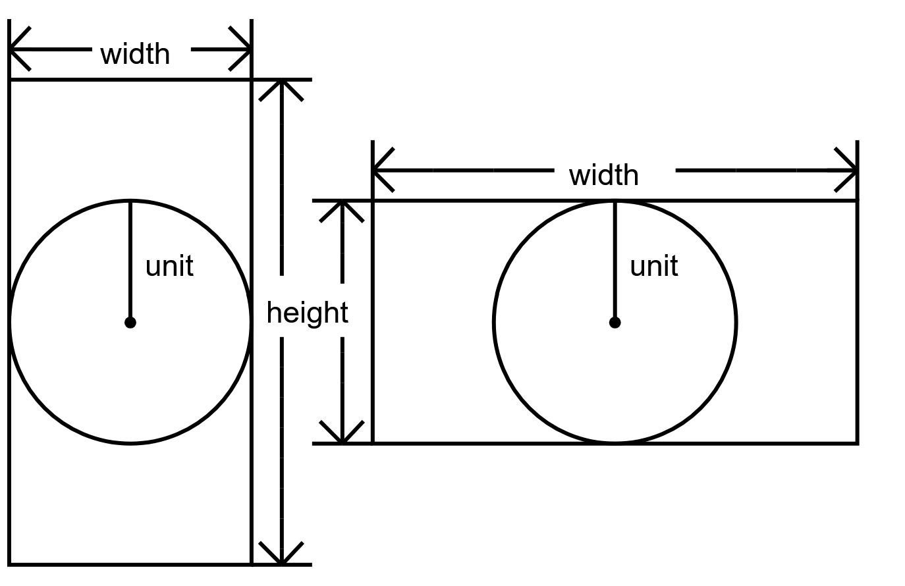
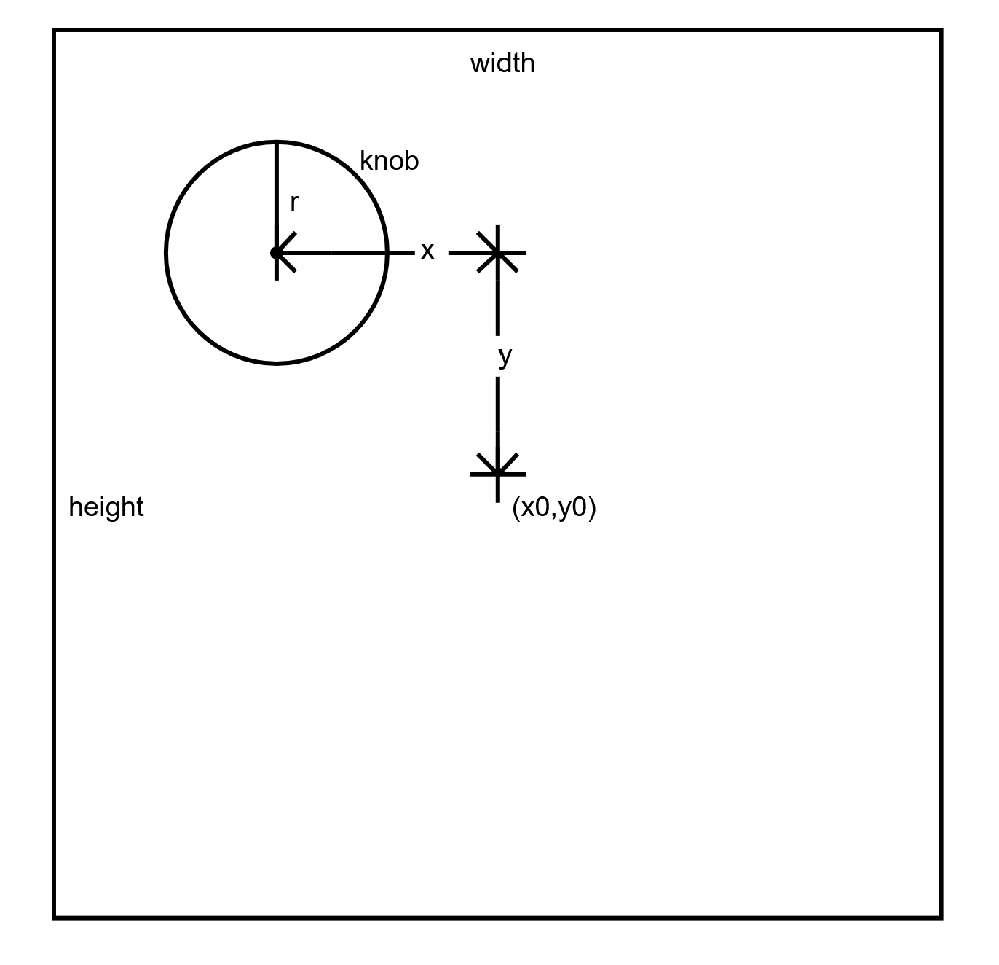

# [mouse-wheel-knobs](https://github.com/lafelabs/mouse-wheel-knobs/)

Use p5js via knobs.js to define virtual knobs in a web browser in knobs.html and pass the values via a web socket to a Python loop knobs.py, which can then control hardware or software.

 - [knobs.html](knobs.html)
 - [knobs.js](knobs.js)
 - [knobs.json](knobs.json)
 - [knobs.py](knobs.py)
 - [p5.js](https://p5js.org/)

## Definition of unit: 

## Definition of element of knobs array

